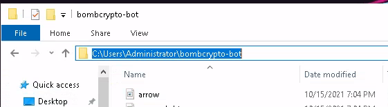

# bot-bombcrypto
Meu primeiro projeto em Python, resolvi fazer um bot para um NFT chamado BombCrypto.
O Bot foi feito apenas para fins de estudos e conforme o meu desenvolvimento, irei adicionar novas funcionalidades.

### Para funcionar de forma segura, recomendo fazer o login através do usuário e senha.
## Não é necessário a sua conta da Metamask


Eu originalmente desenvolvi este bot para meu uso pessoal. Resolvi postar aqui para ajudar as pessoas.

# Instalação:
### Baixe e instale o Python pelo [site](https://www.python.org/downloads/) ou pela [windows store](https://www.microsoft.com/p/python-37/9nj46sx7x90p?activetab=pivot:overviewtab).

Se você baixar pelo site é importante marcar a opção para adicionar o
python ao PATH:


### Realize o download do codigo no formato zip, e extraia o arquivo.

### Copie o caminho até a pasta do bot:



### Abra o terminal.

Aperte a tecla do windows + r e digite "cmd":


### Navegue até a pasta do bot:
Digite o comando "cd" + caminho que você copiou:


### Instale as dependências:

```
pip install -r requirements.txt
```

  


### Pronto! Agora é só iniciar o bot com o comando

```
python3 index.py
```


# Como usar?

Abra o terminal, se ainda não tiver navegado para a pasta do bot dê novamente o comando

```
"cd" + caminho que você copiou
```

Para iniciar use o comando 

```
python index.py
```

Assim que ele iniciar ele vai começar mandando os bonecos trabalhar. Para que ele funcione é preciso que a janela do game esteja aparecendo na sua tela.
Ele vai constantemente checar se você foi desconectado para realizar o login novamente.
A Cada 5 minutos ele atualiza a posição dos bhero e cada 1 hora coloca todos para trabalhar


